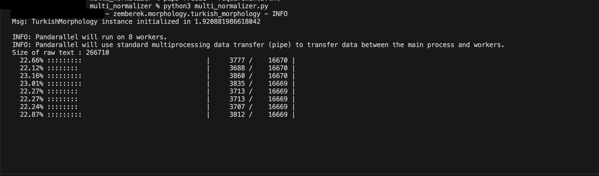
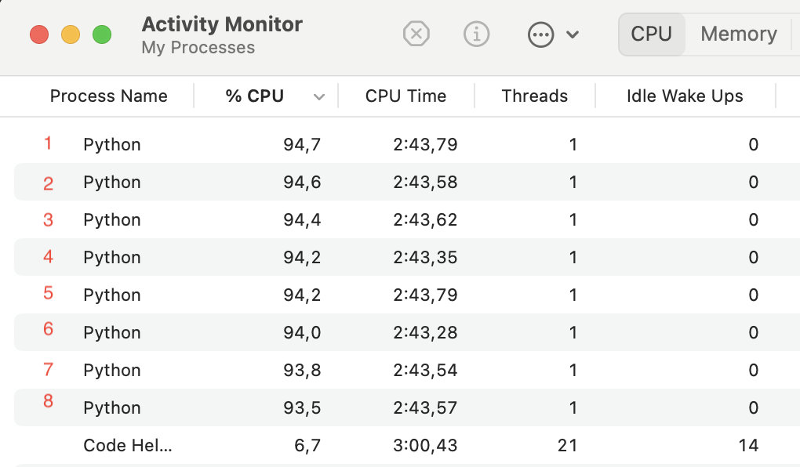
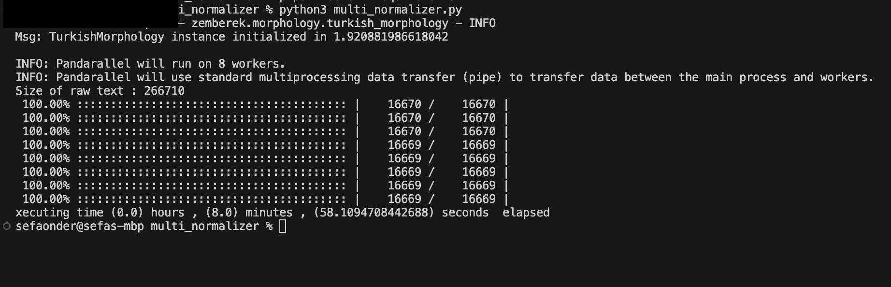

# Multi Normalizer

## Overwiew
Draft python code that parallelizes Turkish raw data to process it.
## About Parallelism

### What is the Parallelism
Parallelism in computer programming refers to the simultaneous execution of multiple tasks or processes, allowing them to progress independently of each other. It's a concept that aims to improve efficiency and performance by dividing a problem into smaller subproblems that can be solved concurrently.

### Assembly Line Production
Imagine a factory assembly line where a complex product is being manufactured. Instead of a single worker assembling the entire product, the process is divided into multiple stations, each handled by a different worker. Each worker focuses on a specific task, and as the product moves along the assembly line, it gets assembled more efficiently. In computer programming, parallelism works similarly by breaking down a larger task into smaller, manageable units that can be processed simultaneously.


(Image Created By Microsoft Bing Image Creator)

the key idea is breaking down a larger task into smaller, independent components that can be worked on simultaneously, leading to more efficient and faster completion. In computer programming, this is achieved by executing multiple threads or processes concurrently, taking advantage of multi-core processors or distributed computing systems.

In this project by dividing the code execution, which would normally take 1 hour on a single core, into 8 cores with the pandas apply() function, it is completed in approximately 8 minutes.

## Features
- parallel_aply() method via pandas provided by the "pandarallel" library
- Normalizing Turkish raw data thanks to the Zemberek library
- Clearing the texts using regex such for special purpose (Clean all Links, Clean unnecessary spaces , Clean mentions ve hashtags)

## Setup & Usage

### Data
The "dataset.csv" file in the source code was added to this repo as a sample draft, not the original, for academic and private reasons within the scope of the research.

You can use [Huggingface](https://huggingface.co/) or [Kaggle](https://www.kaggle.com/) Platforms to work with real Turkish data.

#### The Data Overwiew
| index  | text |
| -------- | ------- |
| 1 | Some unproccesed turkish text 1 |
| 2 | Some unproccesed turkish text 2 |
| 3 | Some unproccesed turkish text 3 |
| ...  | ...  |

#### Limitations
Since Pandas keeps the data in memory, the code may not run for large files (like above the 8GB) due to the low amount of RAM in personel computers. For large files, processing units with high RAM amounts, new code implementations divided into chunks at regular intervals, or open source software used to process large data may be preferred. (such as Apache Spark)

### Requirements
This code tested on Python 3.12

Downloaded libraries
- [numpy](https://numpy.org/)
- [pandarallel](https://nalepae.github.io/pandarallel/)
- [pandas](https://pandas.pydata.org/)
- [zemberek-python](https://github.com/loodos/zemberek-python)

To download all requirements
```bash
pip install -r requirements.txt
```

### For MacOS & Linux

If you set the data correctly, just running the code will be enough.
```bash
python multi_normalizer.py
```

If you use Python3 on bash maybe this command correct
```bash
python3 multi_normalizer.py
```

#### Sample run




It works on 8 cores on the device



The size of the sample data used in the images is approximately 12.6 MB.

### For Windows

For windows in the original [documentation](https://nalepae.github.io/pandarallel/) in the pandarallel library:

> On Windows, because of the multiprocessing system (spawn), the function you send to pandarallel must be self contained, and should not depend on external resources.

For this reason multi_normalizer_windows.py for windows operating system should be work.

***Update***
If we take this [issue](https://github.com/nalepae/pandarallel/issues/125) as the source, it is recommended to use WSL for Windows 64-bit.

## "pandarallel" Library
The pandarallel library is a Python tool that provides parallel processing support for the Pandas library. It allows users to parallelize their Pandas operations, enabling faster computation on large datasets by utilizing multicore processors effectively. With pandarallel, users can easily apply functions to Pandas DataFrames in parallel, significantly improving the performance of tasks like data transformation and manipulation. 

The library seamlessly integrates with Pandas syntax, making it user-friendly for those already familiar with Pandas operations. By harnessing parallel processing, pandarallel is particularly useful for data scientists and analysts working with extensive datasets, offering a straightforward way to speed up data processing tasks in a Pandas-centric workflow.

For more information, please review the library's [documentation](https://nalepae.github.io/pandarallel/)

## "Zemberek" Library
Zemberek-NLP is a Java-based natural language processing (NLP) library designed for the Turkish language. It provides a range of linguistic analysis and processing tools to work with Turkish text. One key feature is text normalization, which involves transforming raw text into a standardized form to improve the accuracy of subsequent language processing tasks.

To normalize Turkish raw texts using Zemberek-NLP, you can leverage its normalization module. This module handles tasks such as spell correction, stemming, and morphological analysis specific to the Turkish language. By utilizing the normalization capabilities, users can enhance the quality of text data for applications like search engines, sentiment analysis, and machine learning models operating on Turkish text.

The normalization process in Zemberek-NLP aids in handling variations in Turkish language input, ensuring a more consistent and standardized representation of the text, which is crucial for effective and accurate natural language understanding and processing.

However, since the language we used was Python, the python-zemberek library was used.

For more information, please review the library's [documentation](https://github.com/loodos/zemberek-python)

## Hardware
While running this code, I ran it on the M1 processor with 8 cores in the macOS operating system. The Pandarallel library uses all the cores available on your system.If we don't get caught up in [theory](https://en.wikipedia.org/wiki/Amdahl%27s_law) the more cores you have, the faster your code will be (if you have enough RAM of course) :D

## Contributing
Contributions are welcome! Feel free to open issues or pull requests to improve the code.

## Note
This code was created for the purpose of pre-processing raw data within the scope of the final year graduation project at Uludağ University Computer Engineering Department.
